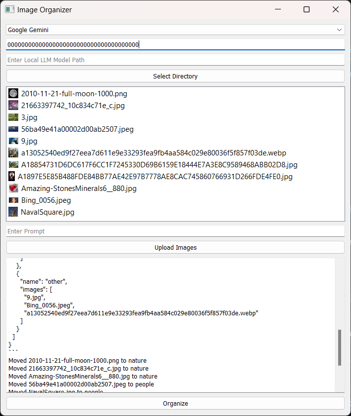

# ddd_image_organize

A Windows 11 image organizer application that uses LLMs, with vision capabilities, accessed through services like OpenAI, Google Gemini, and local interfaces like LM Studio and Ollama, to automatically categorize images into folders based on what is depicted in the images.

## Usage

1.  Clone the repository.
2.  Ensure Python is installed on your system.
3.  Install the required dependencies (e.g., `pip install -r requirements.txt`).
4.  Run the application (`python main.py`).
5.  Choose an LLM with vision capability through an 'API' such as OpenAI, Google Gemini, LM Studio, Ollama or other Local options (Local and LM Studio are both local but for now they are seperate)).
    *   If using LM Studio, provide the `0.json` file to LM Studio's structured output option, to help it provide a structured JSON output. Ensure LM Studio is running and a LLM with vision capability is loaded. The program will attempt to connect to LM Studio at http://127.0.0.1:1234/v1/chat/completions.
    *   "Local" is not implemented. But otherwise you would provide the path to the local LLM model file in the "Enter Local LLM Model Path" text box.
    *   If using OpenAI or Google Gemini, enter your API key.
    *   If using Ollama, ensure Ollama is installed and running. The program is configured to connect to Ollama at http://localhost:11434/v1. No API key is required. The application iterates through each uploaded image, converts it to JPEG format, and sends it to the Ollama server with a prompt to analyze the image and return a single word directory name. The application then creates a folder with that name (if it doesn't exist) and moves the image into that folder.
6.  Select a directory to organize the images into.
7.  Upload images using the "Upload Images" button.
8.  Click the "Organize Images" button.

## Dependencies

*   PyQt5
*   requests
*   openai
*   google.generativeai
*   llama\_cpp (for local LLM)
*   pillow

## Future Goals

*   LM Studio is not able to process or organize images properly, so it needs fixing. Google Gemini and Ollana are working well.
*   Handle greater amounts of images. This limitation might be more with the LLMs and interfaces rather then the program itself.
*   Standardized Organization: Implement a feature to allow users to define a limited set of standard categories for image organization to avoid too many catogories. The prompt option may provide this guidance, but have yet to be tested.
*   Implement a configuration/preference system.

## Future Goals Fixed
*   2025-3-12 - Enhance accuracy in image identification and folder placement.
    The current LLM is not accurate in identifying images. This is an area that needs further development. I assume the issue is that the images are being uploaded to the LLMs incorrectly. This project is being shared on GitHub to encourage contributions to improve this aspect of the project. [Fix: It was rigid prompting that was causing the LLM to be limited.]
